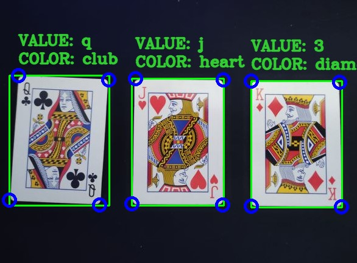

# CardRecognition

Projekt realizowany na przedmiot Komunikacja Człowiek-Komputer.

Authors:
* [Jakub Kaczmarek](https://github.com/kaczmaro)
* [Andrzej Kapczyński](https://github.com/Endrju00)

## Table of contents
* [General info](#general-info)
* [Quick setup](#quick-setup)
* [Technologies](#technologies)
* [Screenshots](#screenshots)

## General info
The application recognizes cards on a uniform background.
## Quick setup

1) Create virtual environment

    ```
    python -m venv venv
    ```
    On linux:
    ```
    source venv/bin/activate
    ```
    On windows (cmd):
    ```
    venv\Scripts\activate.bat
    ```
2) Install prerequisites
   ```
   pip install -r requirements.txt
   ```
3) To use a camera run capture.py
   ```
   python capture.py
   ```
4) To test an app on images run test.py
   ```
   python test.py
   ```
   
## Technologies
Project is created with:
* Python
* OpenCV
* Tensorflow

## Screenshots


